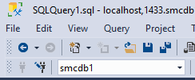
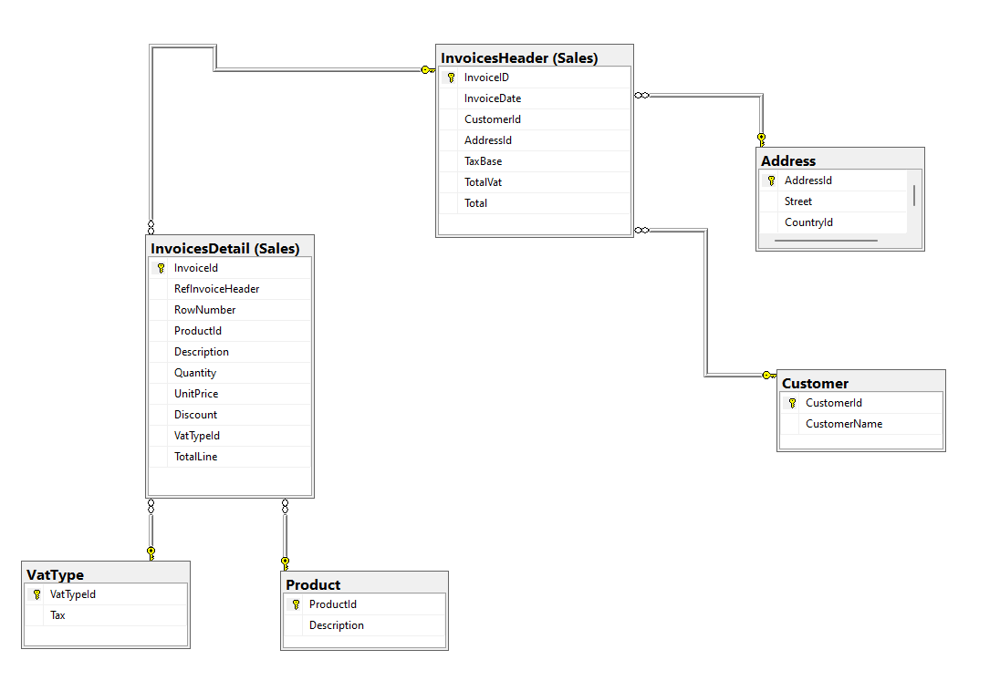

# Creating a New Database with Specified Collation

Para crear una base de datos llamada `smcdb1` con el collation establecido `Modern_spanish_ci_ai`, se ejecuta la query:

```sql
CREATE DATABASE smcdb1 COLLATE Modern_spanish_ci_ai;
```

Las terminaciones "ai" y "ci" en el nombre de una collation en SQL representan diferentes niveles de sensibilidad a mayúsculas y minúsculas y reglas de ordenación de caracteres:

-   "ai" significa "Acento Insensible" (Accent Insensitive) y "ci" significa "Caso Insensible" (Case Insensitive).
-   "Acento Insensible" implica que las comparaciones de caracteres no tienen en cuenta los acentos. Por ejemplo, las letras "á" y "a" se considerarán iguales.
-   "Caso Insensible" significa que las comparaciones de caracteres no distinguen entre mayúsculas y minúsculas. Por ejemplo, las letras "A" y "a" se considerarán iguales.

Por lo tanto, la collation "Modern_spanish_ci_ai" indica que es una collation moderna en español que es insensible a mayúsculas y minúsculas y también insensible a los acentos.
Las terminaciones más comunes que puedes encontrar en los nombres de collations en SQL son:

-   **\_cs** - Case Sensitive: Sensible a mayúsculas y minúsculas.
-   **\_ci** - Case Insensitive: Insensible a mayúsculas y minúsculas.
-   **\_as** - Accent Sensitive: Sensible a acentos.
-   **\_ai** - Accent Insensitive: Insensible a acentos.
-   **\_bin** - Binary: Realiza comparaciones binarias.

Estas terminaciones se pueden combinar de diferentes maneras según las necesidades específicas del entorno y del conjunto de datos. Por ejemplo, una collation puede ser case-insensitive y accent-insensitive (\_ci_ai), o case-sensitive y accent-insensitive (\_cs_ai), entre otras combinaciones.
Las comparaciones binarias se refieren a la comparación de caracteres según su valor binario en la tabla de caracteres utilizada por el sistema operativo o la base de datos.

# Creating a New Table in the Database

Para crear una tabla llamada `Test` en la Base de datos creada previamente (`smcdb1`) primero debemos asegurarnos que antes de ejecutar la query estamos en el contexto de la base de datos `smcdb1`. Para ello, podemos seleccionarlo desde la parte superior izquierda (SSMS):

o usando el comando `USE` en la query:

```sql
-- Cambiar al contexto de la base de datos deseada
USE smcdb1;

-- Crear la tabla sin columnas inicialmente
CREATE TABLE Test (
    Code CHAR(10) PRIMARY KEY
);
```

# Editing table to Add a New Column

Para añadir un nuevo campo a la tabla `Test` una vez creada la tabla se ejecuta el comando `ALTER TABLE <NombreTabla> ADD <NombreCampo> <Tipo>`. Para añadir un nuevo campo con cada uno de los tipos de datos a la tabla `Test` se ejecuta la query:

```sql
-- Añadir columnas después de crear la tabla
ALTER TABLE Test
ADD varchar_field VARCHAR(255),
char_field CHAR(10),
text_field TEXT,
int_field INT,
bigint_field BIGINT,
smallint_field SMALLINT,
decimal_field DECIMAL(10,2),
numeric_field NUMERIC(10,2),
float_field FLOAT,
real_field REAL,
double_field DOUBLE PRECISION,
date_field DATE,
datetime_field DATETIME,
time_field TIME,
timestamp_field TIMESTAMP,
binary_field BINARY(255),
varbinary_field VARBINARY(255),
ID UNIQUEIDENTIFIER DEFAULT NEWID(),
price MONEY
```

# Tipos de Datos

## Tipos de datos de texto

-   **CHAR(n)**: Almacena cadenas de caracteres de longitud fija, con una longitud especificada de 'n'.
-   **VARCHAR(n)**: Almacena cadenas de caracteres de longitud variable, con una longitud máxima especificada de 'n'.
-   **TEXT**: Almacena cadenas de caracteres de longitud variable, sin límite de longitud.
-   **NCHAR(n)**: Almacena cadenas de caracteres de longitud fija en formato Unicode, con una longitud especificada de 'n'.
-   **NVARCHAR(n)**: Almacena cadenas de caracteres de longitud variable en formato Unicode, con una longitud máxima especificada de 'n'.
-   **NTEXT**: Almacena cadenas de caracteres de longitud variable en formato Unicode, sin límite de longitud.

La diferencia principal entre los tipos de datos de texto regulares (CHAR, VARCHAR, TEXT) y sus equivalentes Unicode (NCHAR, NVARCHAR, NTEXT) es que los tipos Unicode permiten almacenar caracteres de cualquier lenguaje, mientras que los tipos regulares están limitados a un conjunto de caracteres específico, generalmente ASCII o ANSI. Los tipos Unicode ocupan más espacio de almacenamiento debido a la representación de caracteres multibyte.

## Tipos de datos numéricos

-   **INT**: Almacena números enteros con un tamaño de 4 bytes. Puede almacenar números enteros en el rango de aproximadamente -2.147.483.648 a 2.147.483.647.
-   **BIGINT**: Almacena números enteros más grandes que INT, con un tamaño de 8 bytes. Puede almacenar números enteros más grandes en el rango de aproximadamente -9.223.372.036.854.775.808 a 9.223.372.036.854.775.807.
-   **SMALLINT**: Almacena números enteros más pequeños que INT, con un tamaño de 2 bytes. Puede almacenar números enteros más pequeños en el rango de aproximadamente -32.768 a 32.767.
-   **DECIMAL(p, s) o NUMERIC(p, s)**: Almacena números decimales precisos, donde 'p' es la precisión total y 's' es la escala (número de dígitos a la derecha del punto decimal). Puede almacenar números decimales precisos con una precisión total de 'p' dígitos y 's' dígitos a la derecha del punto decimal. Por ejemplo, DECIMAL(10, 2) puede almacenar valores como 123456.78.
-   **FLOAT**: Almacena números decimales de punto flotante con precisión sencilla (4 bytes).
-   **REAL**: Almacena números decimales de punto flotante con precisión sencilla (4 bytes), es un sinónimo de FLOAT en SQL Server.
-   **DOUBLE PRECISION**: Almacena números decimales de punto flotante con precisión doble (8 bytes).
-   **BIT**: Almacena un solo bit de información, que puede ser 0 o 1.
-   **TINYINT**: Almacena números enteros muy pequeños, generalmente en el rango de 0 a 255.

## Tipos de datos de tiempos

-   **DATE**:
    -   Uso: Almacena fechas sin hora.
    -   Tamaño en bytes: 3 bytes.
-   **DATETIME** o **TIMESTAMP**:
    -   Uso: Almacena fechas y horas.
    -   Tamaño en bytes: Depende de la implementación y del rango de fechas admitido.
-   **TIME**:
    -   Uso: Almacena solo la parte de tiempo de una fecha/hora.
    -   Tamaño en bytes: Depende de la implementación y del rango de tiempo admitido.

## Otros tipos de datos

12. **BINARY(n)**:

    -   Uso: Almacena cadenas de bytes de longitud fija.
    -   Tamaño en bytes: 'n' bytes.

13. **VARBINARY(n)**:

    -   Uso: Almacena cadenas de bytes de longitud variable, con una longitud máxima especificada de 'n'.
    -   Tamaño en bytes: Varía dependiendo de la longitud de los datos almacenados, más 1 o 2 bytes para la longitud del campo.

14. **BLOB**:

    -   Uso: Almacena datos binarios de gran tamaño, como imágenes o archivos.
    -   Tamaño en bytes: Varía dependiendo del tamaño de los datos almacenados.

15. **BOOLEAN**:
    -   Uso: Almacena valores de verdadero o falso.
    -   Tamaño en bytes: 1 byte.

# Ventajas y Desventajas de usar un INT Autonumérico vs Unique Identifier

## INT Autonumérico

### Ventajas

-   **Tamaño de almacenamiento más pequeño**: Los INTs generalmente ocupan menos espacio de almacenamiento que los identificadores únicos, lo que puede ser importante en bases de datos grandes.
-   **Rendimiento**: Los INTs son más rápidos de generar y comparar que los identificadores únicos, lo que puede mejorar el rendimiento en operaciones de búsqueda y ordenación.
-   **Portabilidad**: Los INTs son más portátiles entre diferentes sistemas de gestión de bases de datos, lo que puede facilitar la migración de datos.

### Desventajas

-   **Limitación de tamaño**: Los INT tienen un rango limitado de valores (aproximadamente -2,147,483,648 a 2,147,483,647).
-   **Posibilidad de colisiones**: Si se insertan muchos registros en una tabla con un INT autonumérico, puede haber colisiones de valores.

## Unique Identifier

### Ventajas

-   **Amplio rango de valores**: Los UNIQUEIDENTIFIER pueden almacenar un rango mucho más amplio de valores (aproximadamente 2^128).
-   **Únicos a nivel global**: Los UNIQUEIDENTIFIER son únicos a nivel global, lo que significa que no hay posibilidad de colisiones.
-   **Mayor seguridad**: Los UNIQUEIDENTIFIER son más difíciles de adivinar que los INT autonuméricos.

### Desventajas

-   **Mayor consumo de espacio**: Los UNIQUEIDENTIFIER ocupan más espacio de almacenamiento que los INT.
-   **Menor rendimiento**: Los índices de tipo UNIQUEIDENTIFIER son más lentos que los de tipo INT.
-   **Dificultad para leer y entender**: Los UNIQUEIDENTIFIER son difíciles de leer y entender para los humanos.

# Uso de Default Values en el Diseño de una Tabla

## ¿Cuándo es adecuado usar Default Values?

El uso de valores predeterminados (Default Values) en el diseño de una tabla puede ser útil en varias situaciones:

-   **Cuando un campo tiene un valor comúnmente utilizado**: Si un campo de la tabla suele tener un valor específico en la mayoría de los casos, puedes establecer ese valor como predeterminado para evitar tener que ingresar el mismo valor repetidamente.

-   **Cuando un campo es opcional**: Si un campo de la tabla es opcional y no es necesario ingresar un valor en la mayoría de los casos, puedes establecer un valor predeterminado para ese campo para evitar tener que ingresar un valor cada vez que se inserta un nuevo registro.

-   **Cuando un campo tiene un valor por defecto lógico**: Si un campo de la tabla tiene un valor lógico que se puede inferir de otros campos, puedes establecer ese valor como predeterminado para simplificar el proceso de inserción de datos.

## Ejemplos de Default Values

### Ejemplo 1: Campo de Fecha: Fecha de Creación (Date Created)

```sql
CREATE TABLE Ejemplo_Fecha (
    id INT PRIMARY KEY,
    fecha_creacion DATE DEFAULT CURRENT_DATE
);
```

### Ejemplo 2: Campo de String: Estado (State)

```sql
CREATE TABLE Ejemplo_Estado (
    id INT PRIMARY KEY,
    estado VARCHAR(50) DEFAULT 'Activo'
);
```

### Ejemplo 3: Campo de Entero: Prioridad (Priority)

```sql
CREATE TABLE Ejemplo_Prioridad (
    id INT PRIMARY KEY,
    prioridad INT DEFAULT 1
);
```

# Insertar Valores en la tabla Test

Para insertar valores nuevos dentro de la tabla test se utiliza la sentencia `INSERT INTO <nombre_tabla> (campos en los que se quiere introducir datos) VALUES (valores para esos campos)`
Si se quieren introducir valores en todas las columnas de la tabla no es necesario especificar las columnas entre parentesis.

```sql
INSERT INTO Test (
	Code,
    varchar_field,
    char_field,
    text_field,
    int_field,
    bigint_field,
    smallint_field,
    decimal_field,
    numeric_field,
    float_field,
    real_field,
    double_field,
    date_field,
    datetime_field,
    time_field,
    binary_field,
    varbinary_field,
    ID,
    price
) VALUES (
	'123456',
    'Ejemplo de cadena de caracteres',
    'Ejemplo',
    'Ejemplo de texto largo',
    123,
    1234567890,
    123,
    123.45,
    123.45,
    123.45,
    123.45,
    123.45,
    '2022-01-01',
    '2022-01-01 12:00:00',
    '2022-01-01 12:00:00',
    0x1234567890ABCDEF,
    0x1234567890ABCDEF,
    NEWID(),
    123.45
);
```

# Copiar una tabla de una base de datos a otra en el mismo servidor

Para copiar la tabla "Test" de la base de datos "smcdb1" a la base de datos "smcdb2" dentro del mismo servidor, puedes utilizar la sentencia `SELECT INTO`.

```sql
SELECT * INTO smcdb2.dbo.Test FROM smcdb1.dbo.Test
```

Esta sentencia crea una nueva tabla llamada "Test" en la base de datos "smcdb2" con la misma estructura y datos que la tabla "Test" en la base de datos "smcdb1".

Si deseas copiar solo la estructura de la tabla sin datos, puedes usar la cláusula WHERE 1 = 0 en la consulta SELECT, de esta manera:

```sql
SELECT * INTO smcdb2.dbo.Test FROM smcdb1.dbo.Test WHERE 1=0;
```

Esto copiará solo la estructura de la tabla, sin datos.
Se podría primero copiar solo la estructura de la tabla y luego mediante un insert añadir los datos

```sql
-- Copiar la estructura de la tabla Test de smcdb1 a smcdb2
SELECT * INTO smcdb2.dbo.Test FROM smcdb1.dbo.Test WHERE 1=0;

-- Copiar los datos de la tabla Test de smcdb1 a smcdb2
INSERT INTO smcdb2.dbo.Test SELECT * FROM smcdb1.dbo.Test;
```

# Crear Tabla en la Base de Datos

Para crear una tabla en la Base deDatos se utiliza el comando `CREATE TABLE <nombre_tabla> (columnas)`. Para crear la tabla Sales.InvoicesHeader primero hemos tenido que crear el schema Sales, en un fichero aparte con el comando

```sql
CREATE SCHEMA Sales;
```

Posteriormente creamos primero las tablas de las que depende la tabla Sales.InvoicesHeader

```sql
CREATE TABLE Countries
(
CountryId INT PRIMARY KEY IDENTITY (1,1),
CountryName VARCHAR(250)
)

CREATE TABLE Address
(
AddressId INT PRIMARY KEY IDENTITY (1,1),
Street VARCHAR(250),
CountryId INT FOREIGN KEY REFERENCES Countries(CountryId)
)

CREATE TABLE Customer
(
CustomerId INT PRIMARY KEY IDENTITY (1,1),
CustomerName VARCHAR(250)
)
```

Y por último creamos la tabla con las respectivas foreign keys a las otras tablas

```sql
CREATE TABLE Sales.InvoicesHeader
(
InvoiceID INT PRIMARY KEY IDENTITY (1,1),
InvoiceDate DATETIME,
CustomerId INT FOREIGN KEY REFERENCES Customer(CustomerId),
AddressId INT FOREIGN KEY REFERENCES Address(AddressId),
TaxBase MONEY,
TotalVat MONEY,
Total MONEY
);
```

Debemos crear una segunda tabla llamada InvoicesDetail y establecer una integridad referencial completa entre ambas. Para ello, cuando creemos la tabla debemos asegurarnos que la foreign key que referencia a la tabla InvoicesHeader sea not null, para que siempre este referenciada

```sql
CREATE TABLE Product
(
ProductId INT PRIMARY KEY IDENTITY (1,1),
Description VARCHAR(MAX)
);

CREATE TABLE VatType
(
VatTypeId INT PRIMARY KEY IDENTITY(1,1),
Tax REAL
);

CREATE TABLE Sales.InvoicesDetail
(
InvoiceId INT PRIMARY KEY IDENTITY (1,1),
RefInvoiceHeader INT FOREIGN KEY REFERENCES Sales.InvoicesHeader(InvoiceId) NOT NULL,
RowNumber INT,
ProductId INT FOREIGN KEY REFERENCES Product(ProductId),
Description VARCHAR(MAX),
Quantity INT,
UnitPrice MONEY,
Discount REAL,
VatTypeId INT FOREIGN KEY REFERENCES VatType(VatTypeId),
TotalLine MONEY
);
```

# Ventajas y desventajas de dejar campos como nulos en una base de datos

## Ventajas:

1. **Flexibilidad en la entrada de datos**: Permitir campos nulos puede ser útil cuando no se tiene información para todos los registros. Por ejemplo, en una tabla de empleados, puede que no se conozca la fecha de nacimiento de algunos empleados, y permitir que el campo sea nulo permite ingresar la información disponible sin necesidad de datos ficticios o arbitrarios.

2. **Ahorro de espacio**: Si un campo no es necesario para todos los registros, permitir que sea nulo puede ahorrar espacio en la base de datos. Esto es especialmente útil en bases de datos grandes con muchos registros.

3. **Simplicidad en la estructura de la base de datos**: Permitir campos nulos puede simplificar la estructura de la base de datos, ya que no es necesario crear tablas adicionales o relaciones complejas para manejar casos donde la información no está disponible.

## Desventajas:

1. **Complejidad en las consultas**: Las consultas que involucran campos nulos pueden ser más complejas y difíciles de escribir y entender.

2. **Riesgo de errores**: Permitir campos nulos puede aumentar el riesgo de errores en la aplicación o en la base de datos. Por ejemplo, si un campo nulo no se maneja correctamente en el código de la aplicación, puede causar errores inesperados o resultados incorrectos.

3. **Dificultad para mantener la integridad de los datos**: Permitir campos nulos puede dificultar el mantenimiento de la integridad de los datos, especialmente en bases de datos grandes con muchos registros. Por ejemplo, si se permite que un campo que debería ser único sea nulo, puede haber duplicados o inconsistencias en los datos.

# Crear Diagrama de la Base de Datos

Para crear un diagrama en la Base de Daatos hay que hacer click derecho encima de la carpeta Database Diagrams -> New Database Diagrams y a continuación seleccionar las tablas que se quieren implementar en el diagrama, creando así el diagrama:



# Uso de campos clave compuestos

Esta estrategia se utiliza cuando una sola columna no es suficiente para identificar de manera única cada fila en una tabla.

Un ejemplo común de cuando se usaría una clave primaria compuesta es en una tabla de detalles de pedidos, donde cada fila puede estar identificada de manera única por el número de pedido y el número de línea del pedido. En este caso, la clave primaria compuesta estaría formada por dos columnas: el número de pedido y el número de línea del pedido.

En cuanto a si es una buena práctica, depende del contexto y de las necesidades específicas de la aplicación. Algunas consideraciones a tener en cuenta son:

-   Complejidad: El uso de claves primarias compuestas puede aumentar la complejidad de las consultas y de la estructura de la base de datos. Esto puede hacer que sea más difícil de entender y mantener.

-   Rendimiento: Las claves primarias compuestas pueden afectar el rendimiento de las consultas, especialmente si se utilizan en tablas grandes con muchas filas.

-   Integridad de los datos: Las claves primarias compuestas pueden ser útiles para garantizar la integridad de los datos en ciertos casos, pero también pueden ser más propensas a errores si no se manejan correctamente.

# Uso de Campos Calculados o Triggers

Usando triggers o campos calculados haz que los campos Total y TotalLine de las tablas se actualice cada vez que un campo relacionado con estos cálculos se actualice.

Dado que para el cálculo de TotalLine necesitamos usar el valor del IVA que está en otra tabla, es necesario usar un trigger y no un campo calculado.

```sql
CREATE TRIGGER ActualizarTotalLine
ON Sales.InvoicesDetail
AFTER INSERT, UPDATE
AS
BEGIN
    UPDATE Sales.InvoicesDetail
    SET TotalLine = (UnitPrice * ((100 - Discount)/100) + (UnitPrice * ((100 - Discount)/100) * v.Tax / 100))* Quantity
    FROM Sales.InvoicesDetail ide
    INNER JOIN VatType v ON ide.VatTypeId = v.VatTypeId;
END;
```

En el caso del campo Total de la tabla Sales.InvoiceHeader, como tenemos todos los datos necesarios solo habrá que crear el campo calculado. Para ello, elimino la columna ya exitente y la vuelvo a crear como un campo calculado que es la suma de los valores TaxBase y TotalVat

# Uso de distintos collation dentro de distintos campos de una tabla

Cuando diferentes campos de una tabla tienen distintos collation, puede haber ciertas limitaciones y consideraciones a tener en cuenta:

1. **Comparaciones de texto**: Cuando se realizan comparaciones o combinaciones de campos con collations diferentes, es posible que se produzcan errores o comportamientos inesperados. Por ejemplo, al comparar o unir campos de texto, el motor de la base de datos puede necesitar realizar conversiones implícitas, lo que puede afectar al rendimiento y la precisión de los resultados.

2. **Ordenamiento**: El ordenamiento de los datos puede ser inconsistente si los campos tienen collations diferentes. Esto puede afectar a consultas que involucran operaciones de ordenamiento, como ORDER BY.

3. **Indices**: Los índices creados en campos con collations diferentes pueden no funcionar de manera óptima o pueden no ser utilizados en absoluto por el optimizador de consultas.

4. **Join y Union**: Al unir tablas o realizar uniones entre consultas que involucran campos con collations diferentes, es posible que se produzcan errores de comparación o que el motor de la base de datos necesite realizar conversiones implícitas.

5. **Consistencia de datos**: Mantener la consistencia de los datos puede ser más complejo cuando se tienen campos con collations diferentes, ya que es posible que se necesiten conversiones explícitas o ajustes adicionales para garantizar que los datos se almacenen y comparen correctamente.

Un ejemplo de cómo diseñar una tabla con campos que tienen collations diferentes:

```sql
CREATE TABLE EjemploTabla (
    ID INT PRIMARY KEY,
    Nombre NVARCHAR(50) COLLATE Latin1_General_CI_AS, -- Collation case-insensitive (CI) con acentos (AS)
    Descripcion VARCHAR(100) COLLATE SQL_Latin1_General_CP1_CS_AS -- Collation case-sensitive (CS) con acentos (AS)
);
```
